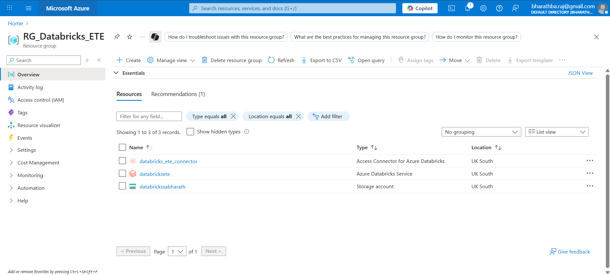
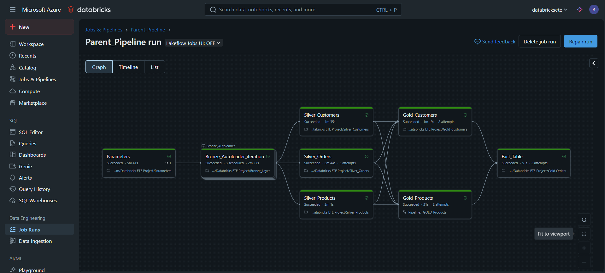

# End-to-End Data Engineering Project on Azure

This repository documents an end-to-end data engineering pipeline built on the Azure cloud platform. The project demonstrates a modern data warehousing solution using Azure Databricks and Azure Data Lake Storage Gen2 to process, transform, and serve data for analytics, following the Medallion architecture.

## Table of Contents
- [Architecture Overview](#architecture-overview)
- [Azure Resources](#azure-resources)
- [Data Pipeline Implementation](#data-pipeline-implementation)
  - [1. Storage and Data Lake Setup](#1-storage-and-data-lake-setup)
  - [2. Bronze Layer: Raw Data Ingestion](#2-bronze-layer-raw-data-ingestion)
  - [3. Silver Layer: Data Cleansing and Transformation](#3-silver-layer-data-cleansing-and-transformation)
  - [4. Gold Layer: Business-Ready Data](#4-gold-layer-business-ready-data)
- [Pipeline Orchestration](#pipeline-orchestration)
- [Data Governance with Unity Catalog](#data-governance-with-unity-catalog)

## Architecture Overview

This project implements a multi-layered data architecture (Bronze, Silver, Gold) to progressively refine data from its raw state to a high-quality, analysis-ready format.

1.  **Data Ingestion**: Raw data lands in a source container in Azure Data Lake Storage (ADLS) Gen2.
2.  **Bronze Layer**: Raw data is ingested into the Bronze layer as Delta tables without any transformation. This provides a historical archive of the source data.
3.  **Silver Layer**: The data from the Bronze layer is cleaned, conformed, and enriched. Common data quality issues are resolved, and the data is structured for easier querying.
4.  **Gold Layer**: Silver-layer data is aggregated and transformed into business-centric models, often as star schemas with fact and dimension tables, ready for BI and analytics.
5.  **Orchestration**: The entire ETL/ELT process is orchestrated using Azure Databricks Jobs, ensuring a reliable and automated workflow.

## Azure Resources

The following Azure resources were provisioned within the `RG_Databricks_ETE` resource group to build the solution:

*   **Azure Databricks Service (`databrickssete`)**: The core engine for data processing and transformation.
*   **Azure Storage Account (`databricksabbharath`)**: Serves as the Azure Data Lake Storage Gen2 for storing all layers of data (Bronze, Silver, and Gold).
*   **Access Connector for Azure Databricks (`databricks_ete_connector`)**: Enables secure access between Azure Databricks and the storage account.

## Data Pipeline Implementation

### 1. Storage and Data Lake Setup

An Azure Storage Account was configured with a hierarchical namespace to function as a Data Lake. Containers were created to logically separate the data according to the Medallion architecture:

*   **`source`**: Landing zone for raw source files.
*   **`bronze`**: Stores raw data ingested from the source as Delta tables.
*   **`silver`**: Stores cleaned and transformed data.
*   **`gold`**: Stores curated, business-level aggregated data for analytics.
*   **`metastore`**: Used by Databricks for managing the Hive Metastore or Unity Catalog metadata.

### 2. Bronze Layer: Raw Data Ingestion

Data from the `source` container is ingested into the `bronze` layer. This layer holds the raw, untouched data as well as checkpoints for streaming ingestion.

### 3. Silver Layer: Data Cleansing and Transformation

In this stage, pipelines run transformations on the Bronze data. This includes data type casting, handling null values, and applying basic business rules. The cleaned data is then stored in the `silver` container.

### 4. Gold Layer: Business-Ready Data

The final layer aggregates the Silver data into consumption-ready tables, such as dimension (`DimCustomers`) and fact (`FactOrders`) tables. These tables are optimized for BI dashboards and analytical queries.

## Pipeline Orchestration

The entire data flow is managed by a master `Parent_Pipeline` in Azure Databricks Jobs. This job orchestrates the execution of individual tasks in the correct order of dependency, from data ingestion to the final creation of the gold fact table.

The Directed Acyclic Graph (DAG) shows the workflow:
*   The `Bronze_Autoloader_Iteration` task ingests new raw data.
*   Silver-layer jobs (`Silver_Customers`, `Silver_Orders`, `Silver_Products`) run in parallel to process the corresponding bronze tables.
*   Gold-layer jobs (`Gold_Customers`, `Gold_Products`) create the dimension tables.
*   Finally, the `Fact_Table` job runs to create the aggregated fact table from the gold dimensions.

A specific task like `GOLD_Products` is implemented as a Delta Live Tables (DLT) pipeline, which simplifies ETL development with declarative execution and deep visibility into pipeline operations.

## Data Governance with Unity Catalog

Unity Catalog is used to provide a unified governance solution for all data and AI assets. It allows us to manage schemas and tables across all three layers (Bronze, Silver, Gold) from a central interface, ensuring fine-grained access control and providing a clear data lineage.